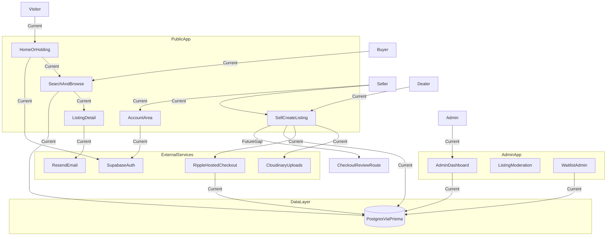
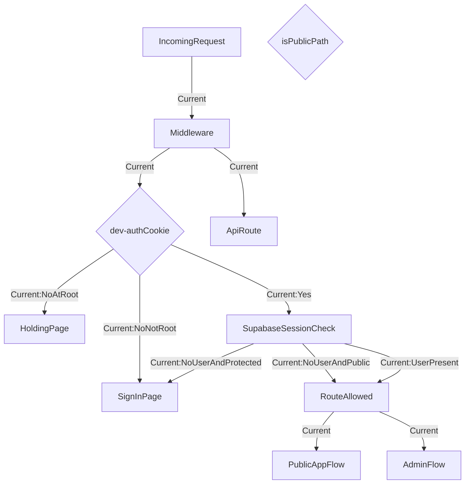
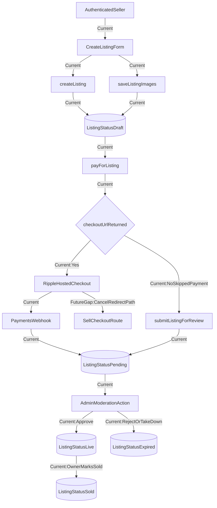
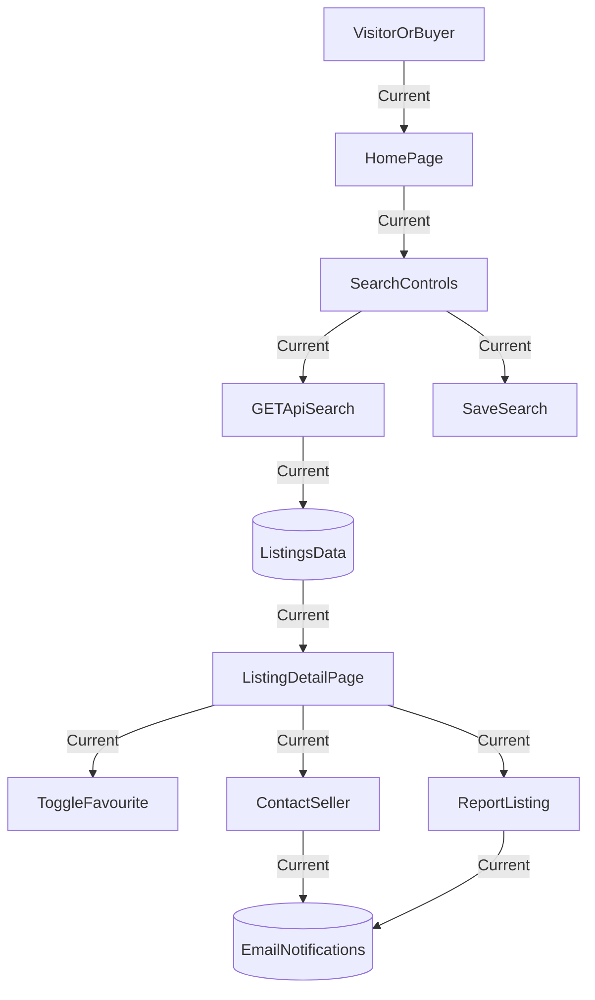
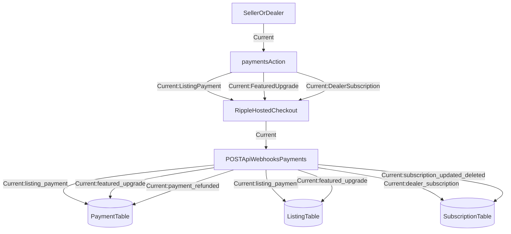
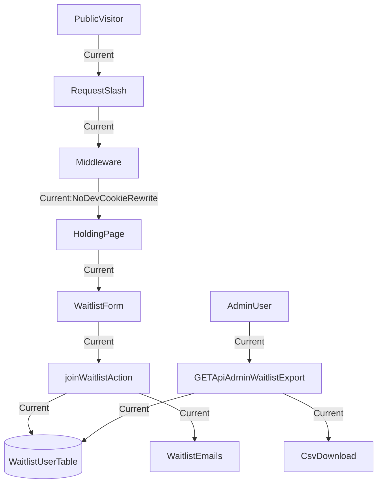

# Client Flow Diagrams

This document is designed for client review and collaborative edits.  
Each Mermaid block can be copied into Mermaid Live Editor.

Important: Mermaid Live Editor cannot parse this whole markdown file at once.
Paste only one Mermaid diagram block at a time, or open one of the standalone `.mmd` files listed below.

Mermaid editor: https://mermaid.ai/live/edit

## How To Use

1. Use one of these standalone Mermaid files:
   - `docs/client-flow-master.mmd`
   - `docs/client-flow-auth.mmd`
   - `docs/client-flow-listing-lifecycle.mmd`
   - `docs/client-flow-discovery.mmd`
   - `docs/client-flow-payments.mmd`
   - `docs/client-flow-waitlist.mmd`
2. Paste the content of a single `.mmd` file into Mermaid Live Editor.
3. Edit node labels or arrows during review.
4. Keep `Current` and `FutureGap` labels so implemented vs planned paths stay clear.
5. If using this markdown file directly, copy only from ```mermaid to ``` for one section.

---

## Master Diagram - Platform Runtime Overview



---

## Section A - Access And Auth Control Flow



---

## Section B - Listing Lifecycle And Moderation



---

## Section C - Discovery, Engagement, And Trust Actions



---

## Section D - Payments And Webhook State Sync



---

## Section E - Prelaunch Waitlist And Admin Export



---

## Future Gaps Register

- `FutureGap`: `SellCheckoutRoute` is referenced as a payment cancel destination in `actions/payments.ts` (`/sell/checkout?listing=...`) but no matching route exists under `app/(public)/sell`.
- `FutureGap`: move in-memory rate limiting (`lib/rate-limit.ts`) to shared/distributed storage for multi-instance reliability.
- `FutureGap`: add explicit user-facing 401/403 handling where `requireRole` throws in API routes to avoid generic 500 responses.
- `FutureGap`: replace temporary TLS bypass behavior in `instrumentation.ts` with production-safe certificate handling.

---

## Source Map (Implemented Flow Evidence)

- Access control: `middleware.ts`, `app/api/dev-auth/route.ts`
- Session/user identity: `app/api/me/route.ts`, `lib/auth/index.ts`, `components/layout/site-header.tsx`
- Discovery/search: `app/(public)/search/page.tsx`, `app/api/search/route.ts`, `components/marketplace/search/search-controls.tsx`
- Listing pipeline: `app/(public)/sell/create-listing-form.tsx`, `actions/listings.ts`, `actions/payments.ts`
- Payment reconciliation: `app/api/webhooks/payments/route.ts`
- Waitlist flow: `app/holding/page.tsx`, `components/waitlist/waitlist-form.tsx`, `actions/waitlist.ts`, `app/api/admin/waitlist/export/route.ts`
- Admin moderation/ops: `app/(admin)`, `actions/admin.ts`
